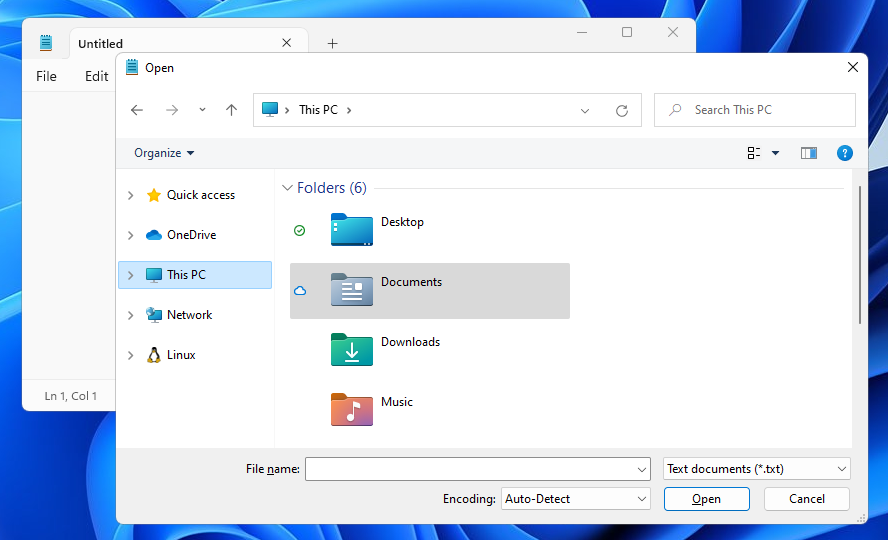

# win-dialog-shot
A simple tool to take screenshots of a window and its modal dialog together — with customizable background for non-client areas. Windows only.

Sample input (cropped):


Sample output (padded to align with input):


## Usage

Run the script. It runs in the background and listens for a global hotkey.
Open your target application and the dialog you want to capture.
Press `Ctrl+Alt+S` — the combined screenshot will be copied to the clipboard.
Paste it directly into your graphics editor, presentation, or documentation.

## Requirements and Installation

1. Requires [Python for Windows](https://www.python.org/downloads/windows/)
2. Install required packages via pip:

```
    pip install pywin32
    pip install mss
    pip install pillow
    pip install keyboard
```

3. Download and run `wds.py`
The script will start in the command line window. Press Ctrl+C in the console to exit.

## Known Issues 

Transparent corners background is currently not supported. 

After some time, the hotkey may stop working due to conflicts with other applications and needs to be restarted. 
     
